
<h1 align="center">基于Java的校园二手物品交易平台的设计与实现+vue</h1>

## 简介
校园二手物品交易平台：提供用户登录、商品浏览与购买、订单管理、论坛互动及商品留言功能，管理员可进行用户与内容管理，支持多种信息查询与操作。    --计算机毕业设计源码；毕设源码；java毕业设计源码

## 联系方式

<h3 align="center">获取完整代码与数据库文件 + 微信：deepguan QQ: 86050149 QQ群: 783742310</h3>

<h3 align="center">可帮忙远程部署 包运行成功！提供远程部署、修改代码、设计文档指导、代码讲解等服务！</h3>

## 功能介绍（完整见运行截图）
管理员：基本功能包括管理员登录和用户注册。系统后台管理主要功能为商品管理、用户管理、订单管理、公告信息管理及论坛管理，以便提供对平台上所有交易活动的全局监控和管理。管理员可通过查看、审核和处理用户的账户信息、商品信息及论坛动态来协助平台的正常运行。管理员还负责处理留言及回复，确保信息交流的顺畅与有效。

用户：用户具备基本功能，包括网站登录和注册，能够浏览和管理个人的购物车以及进行商品搜索。用户可以在前台页面浏览商品详情并添加到购物车，同时支持下单购买及在线付款。个人中心功能允许用户查看和修改个人信息，查询订单，管理收货地址及收藏商品，提升用户对平台的操作便捷性与体验。

商家：商家账户拥有专属的商品管理功能，可以上传和更新商品信息，包括名称、价格、库存及描述等。商家需要处理订单，并可通过后台管理界面查看订单详情与管理发货流程。此外，商家可参与平台论坛讨论及反馈处理，以便与用户及管理员保持沟通。

游客：游客可以自由浏览平台的商品目录及论坛内容，但无法进行购买操作，需注册登录方可体验购物等功能。游客可通过留言功能与平台用户和管理员进行简单互动，为日后注册及参与平台提供初步的认知和了解。

## 运行截图
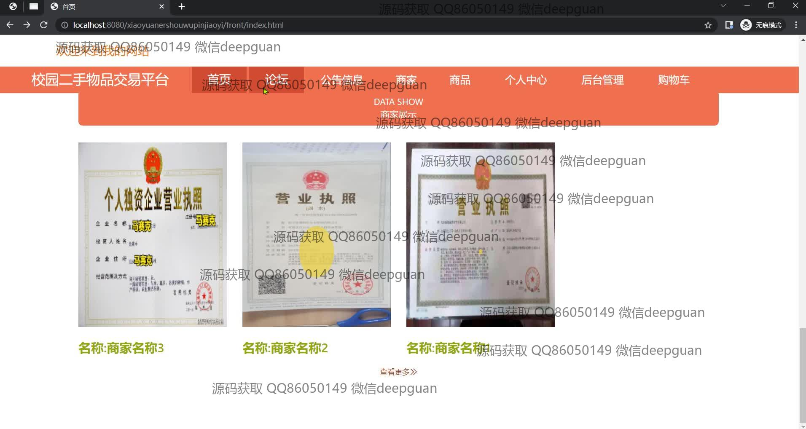
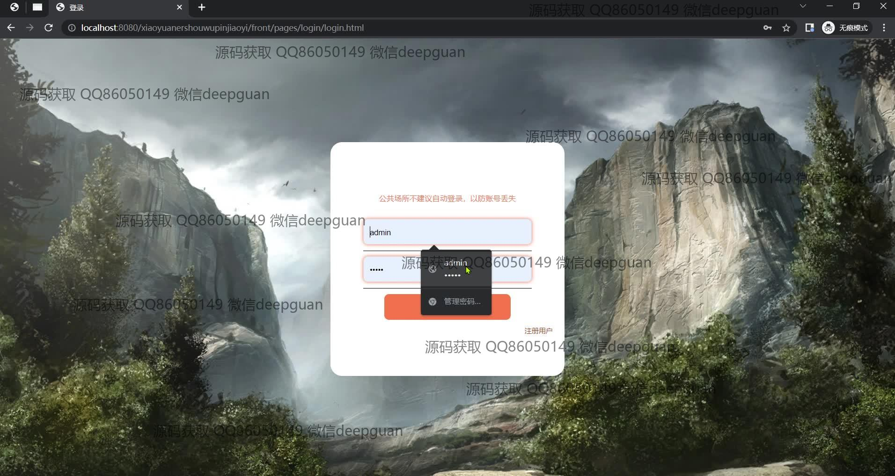
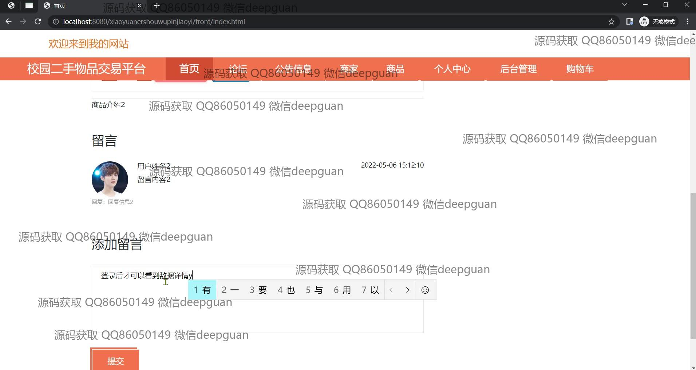
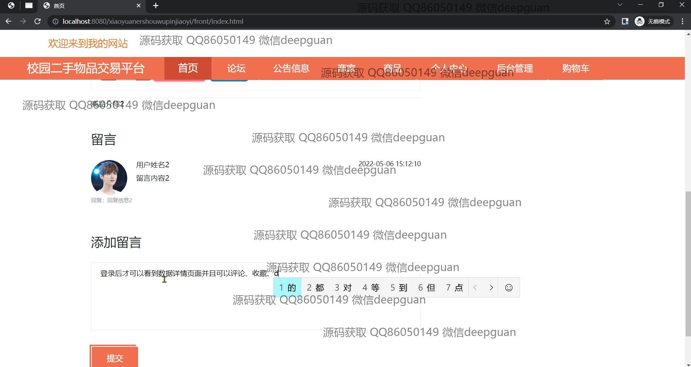
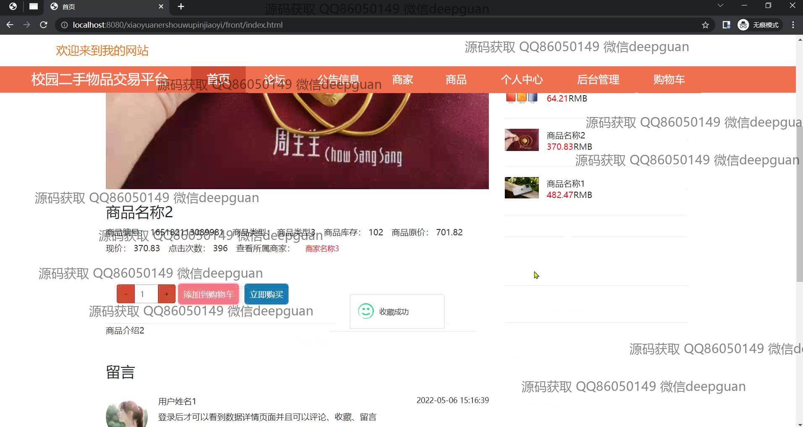
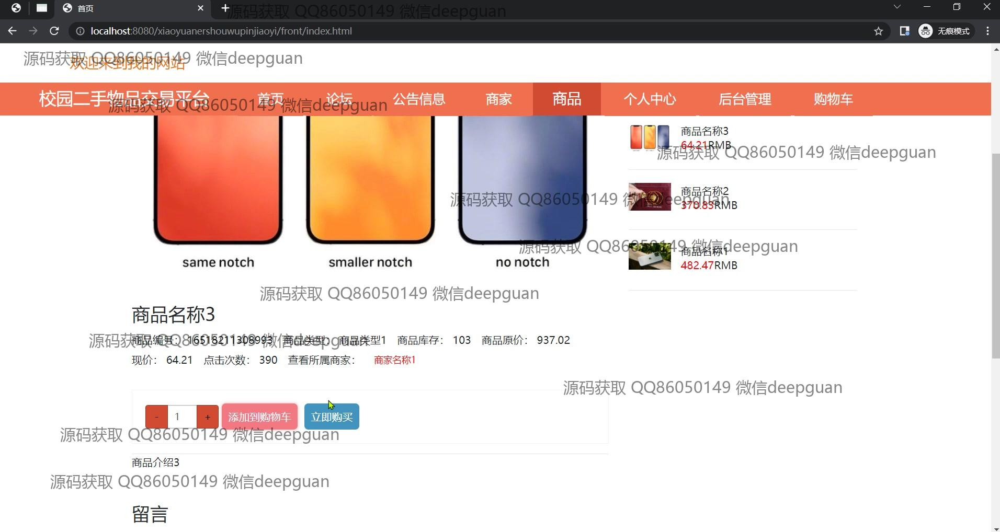
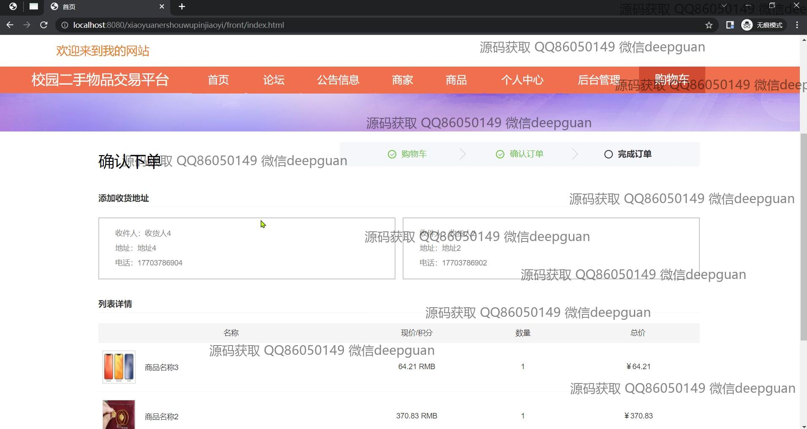
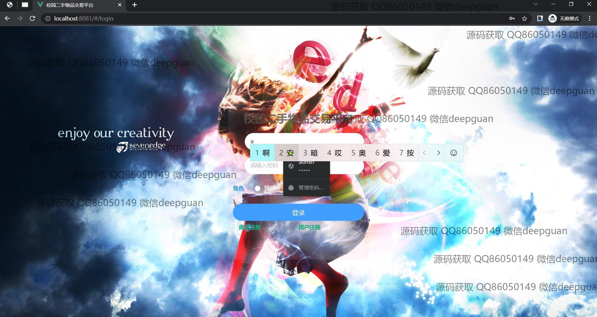
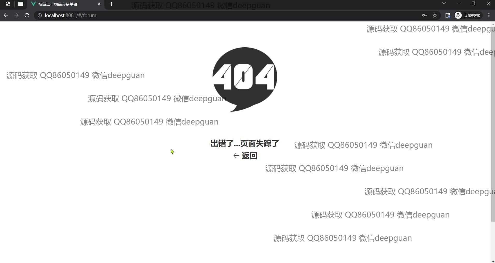
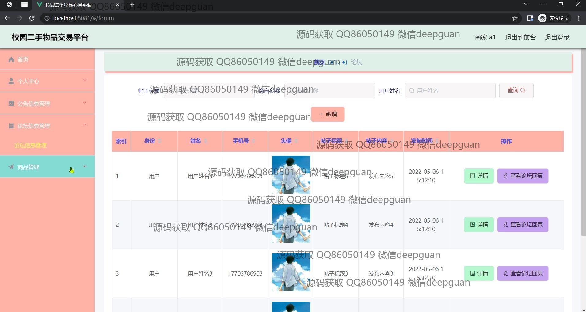
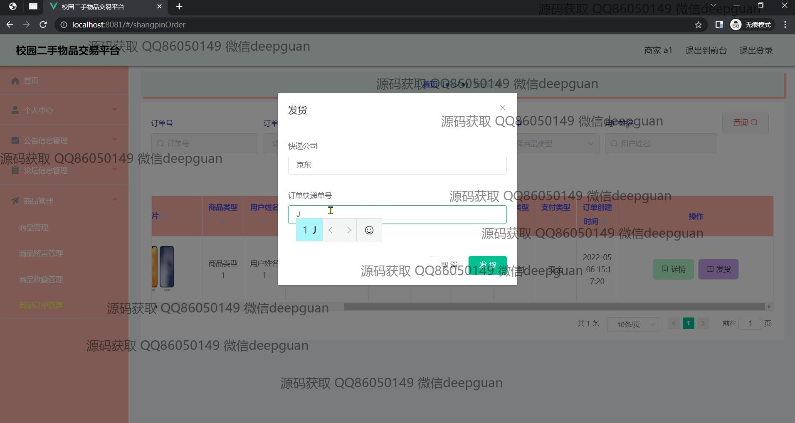
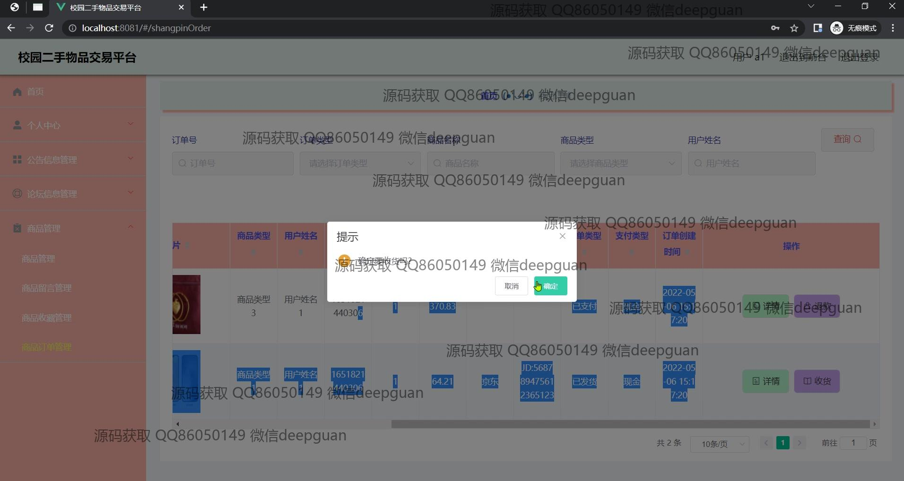
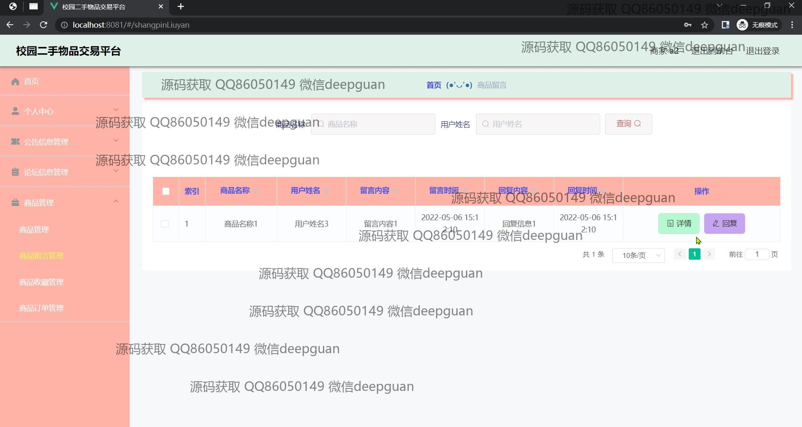
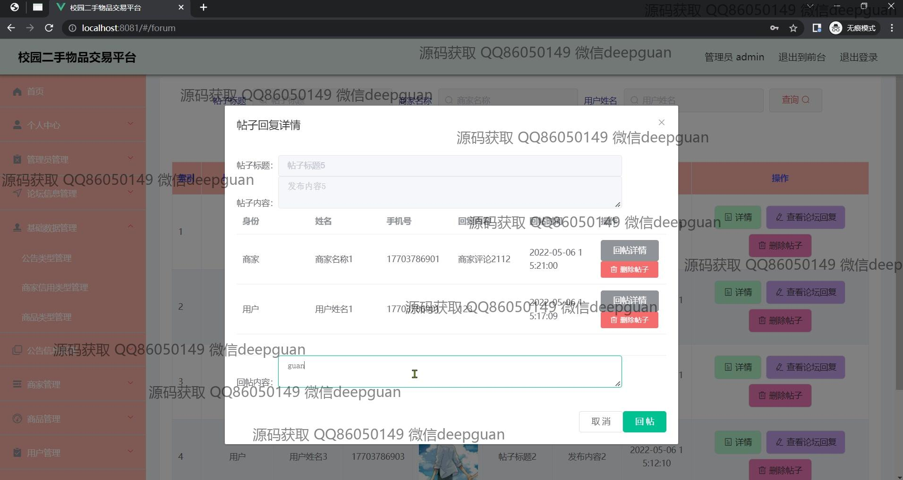

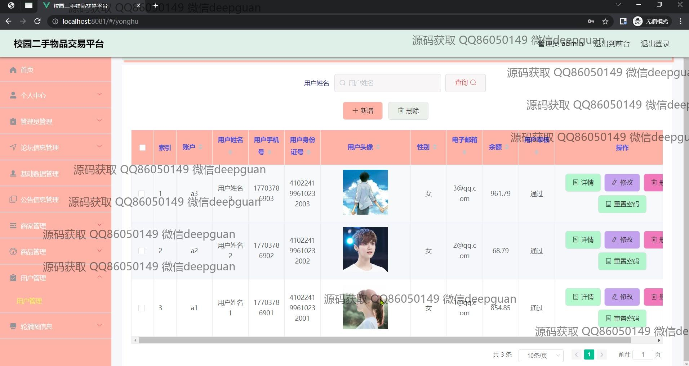

本代码来源于网络,仅供学习参考使用!

